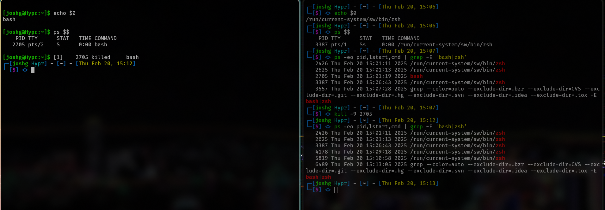

# Intro to Comp Sys - Homework 1

## Problem 1 - Interrupts

### Describe what a hardware interrupt, a trap, and an exception is, and list/justify as many differences as you can identify between any two of those.

1. A hardware interrupt is an asynchronous signal from a hardware device indicating that the device requires attention.
2. A trap is a synchronous transfer of control to the operating system. Traps are used for system calls and can be generated by either the user or system.
3. An exception is a synchronous event that occurs due to errors or unusual conditions during instruction execution. Exceptions occur when the processor detects errors and invokes an exception handler to deal with it.
<div align="center">

|Topic|Hardware Interrupt|Trap|
|:-------:|:-------------------:|:------:|
|Timing|Asynchronous|Synchronous|
|Cause|Hardware Event|Software Event|
|Trigger|External Device/Timer|Program Instruction|
|Return Exception|Can resume program execution|Can resume after OS service|
|Priority|Can be masked by CPU|Not Masked|
</div>

## Problem 2 - Direct Memory Access
### 1. Assume that a Network Card has data to transfer with the end goal to save the data in DRAM. Describe in detail the steps that need to be taken by the CPU, the Network Card, the user program and the OS in order to coordinate the transfer (type of interrupts, register modifications, mode shifts, etc etc).
The steps needed to coordinate the data transfer are as follows:
1. The NIC buffers incoming data and raises a hardware interrupt.
2. The CPU handles the interrupt by having the interrupt handler (ISR) in the NIC driver read the NIC registers, and acknowledges the interrupt.
    - If we are using DMA, the NIC transfers directly to DRAM. Otherwise, the CPU copies the data through Programmed I/O (PIO).
3. The OS processes the data through the kernel network stack, and can copy the data to user-space for it to be used by a waiting process.
4. The OS schedules the user program and switches from kernel to user mode.
5. The user receives the data from the kernel buffer and processes the data.

### 2. How does the CPU know when memory operations are complete
The CPU knows when the memory operation is complete through the use of interrupts and handshakes generated after the memory is ready. This includes interrupts from the memory controller after the DMA transfer is done, ready/wait signals load/store buffers, and polling.

### 3. The CPU is allowed to execute other programs while the DMA controller is transferring data. Does this process interfere at any point during its life-cycle with the execution of user programs? If so,describe when and how interference(s) are caused.
It is possible for there to be interference with user programs. Some potential areas for interference include:
1. The memory bus needing to be used by both the CPU and DMA. If the DMA is sending data over the bus, the CPU needs to wait for the bus to be clear before continuing.
2. Interrupts generated by the DMA controller can force the CPU to deal with the interrupt, which would require pausing the execution of user programs.
3. If the CPU is working with cached data that is being transferred by the DMA controller, the CPU may need to flush registers, thus adding overhead.
4. Peripheral I/O can add overhead if a user program is working with a peripheral that is also needed for the DMA Transfer. 

## Problem 3 - Familiarizing yourself with Linux
### 1. Which instruction gives you your default shell?
```echo $SHELL``` gives you the default shell.

### 2. Which command gives you the current shell?
```echo $0``` gives you the current shell?

### 3. Which instruction gives you the process ID of your current shell?
```ps $$``` or ```echo $$``` will give you the process ID of the current shell.

### 4. Which instructions do you need to use to switch from your default shell to another shell and back to your default shell?
- ```bash``` will switch to a bash shell.
- ```zsh``` will switch to a zsh shell.
- ```fish``` will switch to a fish shell.
- ```dash``` will switch to a dash shell.
- ```exit``` will close the current shell and return to the previous shell.

### 5. Open two different shells in two different terminals, get information from both using either ```ls -some_flag``` or ```ps -some_flag``` or ```htop``` command, and then use another command to terminate the older fo the two shells from the newer shell. Show a screenshot of both terminals with the executed commands.
1. From older bash shell
```
[joshg@Hypr:~]$ echo $0
bash

[joshg@Hypr:~]$ ps $$
    PID TTY      STAT   TIME COMMAND
   2705 pts/2    S      0:00 bash
```

2. From newer zsh shell
```
┌─[joshg@Hypr] - [~] - [Thu Feb 20, 15:06]
└─[$] <> echo $0
/run/current-system/sw/bin/zsh
┌─[joshg@Hypr] - [~] - [Thu Feb 20, 15:06]
└─[$] <> ps $$  
    PID TTY      STAT   TIME COMMAND
   3387 pts/1    Ss     0:00 /run/current-system/sw/bin/zsh
┌─[joshg@Hypr] - [~] - [Thu Feb 20, 15:07]
└─[$] <> ps -eo pid,lstart,cmd | grep -E 'bash|zsh'
   2426 Thu Feb 20 15:01:11 2025 /run/current-system/sw/bin/zsh
   2625 Thu Feb 20 15:01:13 2025 /run/current-system/sw/bin/zsh
   2705 Thu Feb 20 15:01:19 2025 bash
   3387 Thu Feb 20 15:06:43 2025 /run/current-system/sw/bin/zsh
   3557 Thu Feb 20 15:07:28 2025 grep --color=auto --exclude-dir=.bzr --exclude-dir=CVS --exclude-dir=.git --exclude-dir=.hg --exclude-dir=.svn --exclude-dir=.idea --exclude-dir=.tox -E bash|zsh
┌─[joshg@Hypr] - [~] - [Thu Feb 20, 15:07]
└─[$] <> kill -9 2705
┌─[joshg@Hypr] - [~] - [Thu Feb 20, 15:12]
└─[$] <> ps -eo pid,lstart,cmd | grep -E 'bash|zsh'
   2426 Thu Feb 20 15:01:11 2025 /run/current-system/sw/bin/zsh
   2625 Thu Feb 20 15:01:13 2025 /run/current-system/sw/bin/zsh
   3387 Thu Feb 20 15:06:43 2025 /run/current-system/sw/bin/zsh
   4178 Thu Feb 20 15:09:18 2025 /run/current-system/sw/bin/zsh
   5819 Thu Feb 20 15:10:58 2025 /run/current-system/sw/bin/zsh
   6489 Thu Feb 20 15:13:05 2025 grep --color=auto --exclude-dir=.bzr --exclude-dir=CVS --exclude-dir=.git --exclude-dir=.hg --exclude-dir=.svn --exclude-dir=.idea --exclude-dir=.tox -E bash|zsh
┌─[joshg@Hypr] - [~] - [Thu Feb 20, 15:13]
└─[$] <> 
```
<div align="center">

**Screenshot showing the two terminals**  

</div>


**NOTE:** After killing the bash process, we can no longer find that process with the ```ps -eo pid, lstart,cmd | grep -E 'bash|zsh'``` command. It can also be observed that the left terminal exits bash and goes back to the default zsh shell.

## Problem 4 - Altering simple instruction cycle to incorporate interrupts. 
### In a simple computing machine let all memory addresses lower than or equal to 100 belong to the kernel space, and those higher than 100 belong to the user space. Suppose that the mode register has value 0 when the processor is in the kernel mode.

### 1. Which states/phases of handling an instruction must be modified to address the possibility of memory violations or timer interrupts?
1. Decode - During the decode step, if the instruction accesses an address in kernel space (a register with an address <=100), then an execption should be thrown.
2. Exectue - During the execute step, if the instruction attempts an invalid memory access, an interrupt should be raised before execution completes.
3. Timer Interrupt - A timer interrupt should be checked after each instruction is executed, and if a timer interrupt occurs, it should come before instruction execution and transfer control to the OS scheduler.
 
### 2. What if the above two events occur almost simultaneously? How do you imagine that the OS prioritizes to handle these events?
If a memory violation and a timer interrupt occur at the same time, the memory violation should take priority to the timer interrupt. This is because invalid memory access can cause issues with the system, such as instability or insecurity, while timer interrupts do not necessarily indicate an urgent issue. 

## Problem 5: DMA Quantitative Problem

### Part a:
In Polled I/O, we modify the Naïve Receive to Polled Receive because we might end up in a situation where the CPU thinks that data is always available. This issue is fixed with polling because the CPU needs to check that there is data available, preventing access to an empty buffer. The Transmit can remain unchanged because the CPU only writes data when it wants to send a message, meaning that the CPU is the one initiating the transmission anyway.

---

### Part b:
A fictitious processor (CPU) has a fictitious OS loaded and together they have the following characteristics/performance metrics:

- **Load from memory:** 300 clock cycles
- **Store to memory:** 250 clock cycles
- **Interrupt latency for first interrupt (initiating):** 2,500 instructions (assume each instruction takes two clock cycles)
- **Interrupt latency for second interrupt (concluding):** 800 instructions (assume each instruction takes two clock cycles)
- **Set up information for DMA:** 4 loads (base and bound registers)

#### Packet Size for PIO to be Faster than DMA
For packet sizes less than or equal to **14 bytes**, PIO is faster than DMA.

For PIO:
- The **load** takes **300 cycles**.
- The **store to memory** takes **250 cycles**.
- Each byte is transmitted separately.
- Total PIO latency:

$$
\text{Latency}_{PIO} = (250 + 300)N = 550N
$$

where \( N \) is the total number of bytes.

For DMA:
- **First interrupt latency:** \( 2500 \times 2 = 5000 \) cycles
- **Second interrupt latency:** \( 800 \times 2 = 1600 \) cycles
- **Setup time:** \( 4 \times 300 = 1200 \) cycles
- Total DMA latency:

$$
\text{Latency}_{DMA} = 5000 + 1200 + 1600 = 7800
$$

Solving the inequality for \( N \):

$$
550N < 7800
$$

$$
N < \frac{7800}{550} = 14.18
$$

Since \( N \) must be an integer, **PIO is faster for packet sizes \( N \leq 14 \)**.

---

### Effect of Memory-Mapped Registers (RISC-V)
Since RISC-V is **64-bit**, a register can store **8 bytes** at a time. This means we can now transfer **8 bytes per store** instead of 1.

- The **load and store for the 8 bytes** still take **300 cycles** and **250 cycles**, respectively.
- We can now transmit **8 bytes over 550 cycles instead of just 1**.
- The new PIO latency model:

$$
\text{Latency}_{PIO} = \frac{550N}{8}
$$

The DMA latency remains the same, so solving the inequality again:

$$
\frac{550N}{8} < 7800
$$

$$
N < \frac{7800 \times 8}{550} = 113.45
$$

Rounding down, **PIO is faster for packet sizes \( N \leq 113 \) bytes**.
